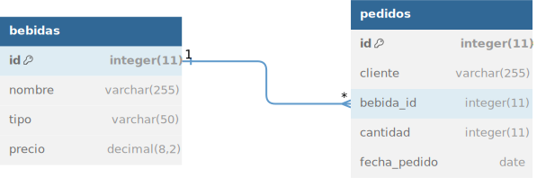

# TPE-WEB2

## Trabajo Practico Especial WEB 2

**Integrantes:** 
- Roberto Ricardo (roberto060804@gmail.com) 
- Simon Salvador (salvadorsimon14@gmail.com).

**Tematica:** 
* BodegaDigital - Tienda de bebidas online.

**Descripcion:** 
Desarrollaremos una tienda de bebidas online desde donde cualquier cliente podra comprar una gran variedad de distintas bebidas (Gaseosas, Vinos, Cervezas, Gin, etc.). Comenzamos el proyecto creando nuestra base de datos en SQL (db_bodega.sql) con dos tablas principales. La primera tabla "bebidas" (id, nombre, tipo, precio) contiene la informacion sobre las bebidas disponibles en la tienda con un id unico que las identifica. La segunda tabla "pedidos" (id, cliente, bebida_id, cantidad, fecha_pedido) contiene informacion sobre los pedidos realizados por los distintos clientes identificados con un id unico y esta relacionada con la tabla "bebidas" a traves de una foreign key (bebida_id) que identifica la bebida elegida por el cliente. Con estas dos tablas relacionadas mediante la foreign key tenemos una base de datos solida para rastrear las bebidas disponibles y los pedidos de los clientes. Podremos realizar consultas para recuperar informacion sobre pedidos especificos, inventario de bebidas, entre otras.

